# Phase C: Detailed Extraction Plan

**Date:** 2025-10-01
**Status:** 🔄 In Progress

---

## Dependency Map

### High-Level Dependencies

```mermaid
graph TD
    %% Main Experiments (Stay in experiments/)
    EXP1[run_neuroimaging_clinical_validation]
    EXP2[run_subtype_classification_validation]
    EXP3[run_pd_subtype_discovery]
    EXP4[run_disease_progression_validation]
    EXP5[run_biomarker_discovery_validation]
    EXP6[run_external_cohort_validation]

    %% Data Processing (analysis/clinical/data_processing.py)
    DP1[_train_sgfa_with_neuroimaging_cv]
    DP2[_run_sgfa_training]
    DP3[_evaluate_sgfa_test_set]
    DP4[_run_sgfa_analysis]
    DP5[_apply_trained_model]

    %% Metrics (analysis/clinical/metrics.py)
    M1[_calculate_detailed_metrics]
    M2[_analyze_clinical_interpretability]

    %% Classification (analysis/clinical/classification.py)
    C1[_validate_factors_clinical_prediction]
    C2[_test_factor_classification]
    C3[_test_cross_cohort_classification]

    %% Subtypes (analysis/clinical/subtype_analysis.py)
    S1[_discover_pd_subtypes]
    S2[_validate_subtypes_clinical]
    S3[_analyze_pd_subtype_stability]
    S4[_analyze_subtype_factor_patterns]
    S5[_analyze_subtype_stability]
    S6[_analyze_clinical_subtypes_neuroimaging]

    %% Progression (analysis/clinical/progression_analysis.py)
    P1[_analyze_cross_sectional_correlations]
    P2[_analyze_longitudinal_progression]
    P3[_validate_progression_prediction]
    P4[_analyze_clinical_milestones]

    %% Biomarkers (analysis/clinical/biomarker_analysis.py)
    B1[_discover_neuroimaging_biomarkers]
    B2[_analyze_factor_outcome_associations]
    B3[_analyze_feature_importance]
    B4[_validate_biomarker_panels]
    B5[_test_biomarker_robustness]

    %% External Validation (analysis/clinical/external_validation.py)
    EV1[_compare_factor_distributions]
    EV2[_test_cross_cohort_classification]
    EV3[_analyze_model_transferability]

    %% Dependencies
    EXP1 --> DP1
    EXP1 --> C1
    EXP1 --> B1
    EXP1 --> S6

    DP1 --> DP2
    DP1 --> DP3

    EXP2 --> DP4
    EXP2 --> C2
    EXP2 --> M2
    EXP2 --> S5

    EXP3 --> DP4
    EXP3 --> S1
    EXP3 --> S2
    EXP3 --> S3
    EXP3 --> S4

    EXP4 --> DP4
    EXP4 --> P1
    EXP4 --> P2
    EXP4 --> P3
    EXP4 --> P4

    EXP5 --> DP4
    EXP5 --> B2
    EXP5 --> B3
    EXP5 --> B4
    EXP5 --> B5

    EXP6 --> DP4
    EXP6 --> DP5
    EXP6 --> EV1
    EXP6 --> EV2
    EXP6 --> EV3

    %% Internal dependencies
    C2 --> M1
    S5 --> DP4
    S5 --> S1
    P4 --> C2
    B5 --> DP4
    B5 --> B2
    EV2 --> M1
```



### Critical Dependencies

**No circular dependencies detected** ✅

**Extraction Order (by dependency depth):**
1. **Level 0 (No dependencies on other extracted methods):**
   - `_calculate_detailed_metrics()` - Used by 3 methods
   - `_run_sgfa_training()` - Basic SGFA execution
   - `_evaluate_sgfa_test_set()` - Basic evaluation
   - `_apply_trained_model()` - Apply trained model
   - `_analyze_clinical_interpretability()` - Statistical analysis
   - `_discover_pd_subtypes()` - Clustering
   - `_validate_subtypes_clinical()` - Validation
   - `_analyze_subtype_factor_patterns()` - Pattern analysis
   - `_analyze_cross_sectional_correlations()` - Correlations
   - `_analyze_longitudinal_progression()` - Progression
   - `_validate_progression_prediction()` - Prediction
   - `_analyze_factor_outcome_associations()` - Associations
   - `_analyze_feature_importance()` - Feature analysis
   - `_validate_biomarker_panels()` - Panel validation
   - `_compare_factor_distributions()` - Distribution comparison
   - `_analyze_model_transferability()` - Transferability

2. **Level 1 (Depends on Level 0):**
   - `_train_sgfa_with_neuroimaging_cv()` - Uses `_run_sgfa_training()`, `_evaluate_sgfa_test_set()`
   - `_validate_factors_clinical_prediction()` - Uses `_calculate_detailed_metrics()`
   - `_test_factor_classification()` - Uses `_calculate_detailed_metrics()`
   - `_test_cross_cohort_classification()` - Uses `_calculate_detailed_metrics()`
   - `_discover_neuroimaging_biomarkers()` - Standalone
   - `_analyze_clinical_subtypes_neuroimaging()` - Standalone

3. **Level 2 (Depends on Level 1):**
   - `_analyze_clinical_milestones()` - Uses `_test_factor_classification()`
   - `_test_biomarker_robustness()` - Uses `_analyze_factor_outcome_associations()`
   - `_analyze_subtype_stability()` - Uses `_discover_pd_subtypes()`
   - `_analyze_pd_subtype_stability()` - Uses `_discover_pd_subtypes()`

**Note:** `_run_sgfa_analysis()` at line 1906 is used by 10 call sites but doesn't call other extracted methods.

---

## Standard Data Structures

### 1. SGFA Result Format

```python
SGFAResult = Dict[str, Any]
{
    "W": List[np.ndarray],              # Loadings per view
    "Z": np.ndarray,                     # Latent factors (N x K)
    "W_samples": Optional[np.ndarray],   # MCMC samples for W
    "Z_samples": Optional[np.ndarray],   # MCMC samples for Z
    "samples": Optional[Dict],           # All MCMC samples
    "log_likelihood": float,             # Model log likelihood
    "n_iterations": int,                 # Number of iterations
    "convergence": bool,                 # Convergence status
    "execution_time": float,             # Runtime in seconds
    "hyperparameters": Dict,             # Hyperparameters used
    "clinical_info": Optional[Dict],     # Clinical metadata
}
```

### 2. Clinical Data Format

```python
ClinicalData = Dict[str, Union[np.ndarray, List]]
{
    "diagnosis": np.ndarray,             # Required: Diagnostic labels (N,)
    "subject_id": np.ndarray,            # Required: Subject IDs (N,)
    "age": Optional[np.ndarray],         # Age in years (N,)
    "sex": Optional[np.ndarray],         # Sex/gender (N,)
    "disease_duration": Optional[np.ndarray],  # Disease duration (N,)
    "updrs": Optional[np.ndarray],       # UPDRS scores (N,)
    "moca": Optional[np.ndarray],        # MoCA scores (N,)
    "progression_scores": Optional[np.ndarray],  # Progression (N,)
    # ... additional clinical measures as needed
}
```

### 3. Classification Results Format

```python
ClassificationResult = Dict[str, Any]
{
    "cross_validation": Dict[str, float],  # CV scores per metric
    "detailed_metrics": Dict[str, float],   # Full metrics
    "feature_type": str,                    # Type of features used
    "model_name": Optional[str],            # Classifier name
    "confusion_matrix": Optional[List[List[int]]], # Confusion matrix
}
```

### 4. Metrics Format

```python
DetailedMetrics = Dict[str, Union[float, List]]
{
    "accuracy": float,
    "precision": float,
    "recall": float,
    "f1_score": float,
    "roc_auc": float,
    "confusion_matrix": List[List[int]],
    "specificity": Optional[float],      # Binary classification only
    "npv": Optional[float],              # Binary classification only
    "ppv": Optional[float],              # Binary classification only
}
```

### 5. Subtype Discovery Results

```python
SubtypeResult = Dict[str, Any]
{
    "optimal_k": int,                    # Optimal number of clusters
    "cluster_range": List[int],          # Tested cluster numbers
    "silhouette_scores": List[float],    # Silhouette scores
    "calinski_scores": List[float],      # Calinski-Harabasz scores
    "solutions": Dict[int, Dict],        # All clustering solutions
    "best_solution": Dict[str, Any],     # Best clustering solution
}
```

---

## Module 1: analysis/clinical/data_processing.py

### Class: ClinicalDataProcessor

**Purpose:** SGFA execution and data preparation for clinical validation

**Constructor:**
```python
class ClinicalDataProcessor:
    def __init__(
        self,
        neuroimaging_cv_config: NeuroImagingCVConfig,
        clinical_splitter: ClinicalAwareSplitter,
        logger: Optional[logging.Logger] = None
    ):
        """
        Initialize clinical data processor.

        Args:
            neuroimaging_cv_config: Neuroimaging CV configuration
            clinical_splitter: Clinical-aware CV splitter
            logger: Optional logger instance
        """
```

**Methods to Extract (5):**

#### 1. train_sgfa_with_neuroimaging_cv()
```python
def train_sgfa_with_neuroimaging_cv(
    self,
    X_list: List[np.ndarray],
    clinical_data: Dict,
    hypers: Dict,
    args: Dict,
    batch_size: Optional[int] = None
) -> Dict:
    """
    Train SGFA using neuroimaging-specific cross-validation.

    Args:
        X_list: List of data views (each N x D_i)
        clinical_data: Clinical data dictionary
        hypers: SGFA hyperparameters
        args: Additional arguments
        batch_size: Optional batch size for processing

    Returns:
        Dict with keys:
            - folds: List of fold results
            - mean_metrics: Average metrics across folds
            - best_model: Best performing model
            - factors: Extracted latent factors

    Dependencies:
        - Calls: run_sgfa_training(), evaluate_sgfa_test_set()
        - External: ClinicalAwareSplitter, NeuroImagingMetrics
    """
    # Source: Line 203-340 (138 lines)
```

#### 2. run_sgfa_training()
```python
def run_sgfa_training(
    self,
    X_train: List[np.ndarray],
    hypers: Dict,
    args: Dict
) -> Dict:
    """
    Run single SGFA training iteration.

    Args:
        X_train: Training data views
        hypers: SGFA hyperparameters
        args: Additional arguments

    Returns:
        SGFAResult dictionary

    Dependencies:
        - Calls: None (external SGFA model only)
        - External: models.models (from core.run_analysis)
    """
    # Source: Line 341-433 (93 lines)
```

#### 3. evaluate_sgfa_test_set()
```python
def evaluate_sgfa_test_set(
    self,
    X_test: List[np.ndarray],
    trained_model: Dict,
    clinical_test_data: Dict
) -> Dict:
    """
    Evaluate SGFA model on held-out test set.

    Args:
        X_test: Test data views
        trained_model: Trained SGFA model
        clinical_test_data: Clinical data for test subjects

    Returns:
        Dict with evaluation metrics

    Dependencies:
        - Calls: None
        - External: NeuroImagingMetrics
    """
    # Source: Line 434-473 (40 lines)
```

#### 4. run_sgfa_analysis()
```python
def run_sgfa_analysis(
    self,
    X_list: List[np.ndarray],
    hypers: Dict,
    args: Dict,
    **kwargs
) -> Dict:
    """
    Run complete SGFA MCMC analysis for clinical validation.

    Args:
        X_list: List of data views
        hypers: SGFA hyperparameters (must include 'K')
        args: MCMC arguments (num_warmup, num_samples, num_chains, etc.)
        **kwargs: Additional arguments

    Returns:
        SGFAResult dictionary with MCMC samples

    Dependencies:
        - Calls: None
        - External: JAX, NumPyro (MCMC, NUTS), models.models

    Note: This is the REAL implementation at line 1906.
          The mock version at line 1310 should be REMOVED.
    """
    # Source: Line 1906-2027 (122 lines)
```

#### 5. apply_trained_model()
```python
def apply_trained_model(
    self,
    X_new: List[np.ndarray],
    trained_model: Dict,
    clinical_new_data: Optional[Dict] = None
) -> Dict:
    """
    Apply trained SGFA model to new data.

    Args:
        X_new: New data views
        trained_model: Previously trained model
        clinical_new_data: Optional clinical data for new subjects

    Returns:
        Dict with factors and predictions for new data

    Dependencies:
        - Calls: None
        - External: SGFA inference functions
    """
    # Source: Line 2277-2306 (30 lines)
```

**Total Lines:** ~423 lines

**External Dependencies:**
```python
import jax
import numpy as np
from typing import Dict, List, Optional
from numpyro.infer import MCMC, NUTS
from core.run_analysis import models
from analysis.cross_validation_library import (
    ClinicalAwareSplitter,
    NeuroImagingCVConfig,
    NeuroImagingMetrics
)
```

---

## Module 2: analysis/clinical/metrics.py

### Class: ClinicalMetrics

**Purpose:** Calculate clinical validation metrics and interpretability analyses

**Constructor:**
```python
class ClinicalMetrics:
    def __init__(
        self,
        metrics_list: Optional[List[str]] = None,
        logger: Optional[logging.Logger] = None
    ):
        """
        Initialize clinical metrics calculator.

        Args:
            metrics_list: List of metrics to calculate
                         Default: ["accuracy", "precision", "recall", "f1_score", "roc_auc"]
            logger: Optional logger instance
        """
        self.metrics_list = metrics_list or [
            "accuracy", "precision", "recall", "f1_score", "roc_auc"
        ]
        self.logger = logger
```

**Methods to Extract (2):**

#### 1. calculate_detailed_metrics()
```python
def calculate_detailed_metrics(
    self,
    y_true: np.ndarray,
    y_pred: np.ndarray,
    y_pred_proba: np.ndarray,
    requested_metrics: Optional[List[str]] = None
) -> Dict[str, Union[float, List]]:
    """
    Calculate detailed classification metrics.

    Args:
        y_true: True labels (N,)
        y_pred: Predicted labels (N,)
        y_pred_proba: Predicted probabilities (N, n_classes)
        requested_metrics: Optional list of metrics to calculate
                          Uses self.metrics_list if None

    Returns:
        DetailedMetrics dictionary

    Dependencies:
        - Calls: None
        - External: sklearn.metrics

    Used By:
        - _test_factor_classification() (3 times)
        - _test_cross_cohort_classification() (2 times)
    """
    # Source: Line 1420-1466 (47 lines)
```

#### 2. analyze_clinical_interpretability()
```python
def analyze_clinical_interpretability(
    self,
    Z: np.ndarray,
    clinical_labels: np.ndarray,
    sgfa_result: Dict
) -> Dict:
    """
    Analyze clinical interpretability of latent factors.

    Args:
        Z: Latent factors (N x K)
        clinical_labels: Clinical labels (N,)
        sgfa_result: SGFA result dictionary

    Returns:
        Dict containing:
            - factor_correlations: Factor-label correlations
            - discriminative_factors: Most discriminative factors
            - factor_statistics: Statistical tests per factor

    Dependencies:
        - Calls: None
        - External: scipy.stats (f_oneway, pointbiserialr)
    """
    # Source: Line 1468-1556 (89 lines)
```

**Total Lines:** ~136 lines

**External Dependencies:**
```python
import numpy as np
from typing import Dict, List, Optional, Union
from scipy import stats
from sklearn.metrics import (
    accuracy_score,
    confusion_matrix,
    f1_score,
    precision_score,
    recall_score,
    roc_auc_score
)
```

**Priority:** ⭐⭐⭐ **HIGH** - Pure utility functions, no experiment logic, widely reused

---

## Module 3: analysis/clinical/classification.py

### Class: ClinicalClassifier

**Purpose:** Clinical classification and prediction utilities

**Constructor:**
```python
class ClinicalClassifier:
    def __init__(
        self,
        metrics_calculator: ClinicalMetrics,
        classification_models: Optional[Dict] = None,
        logger: Optional[logging.Logger] = None
    ):
        """
        Initialize clinical classifier.

        Args:
            metrics_calculator: ClinicalMetrics instance
            classification_models: Dict of sklearn classifiers
                                  Default: logistic, random forest, SVM
            logger: Optional logger instance
        """
        self.metrics = metrics_calculator
        self.classification_models = classification_models or {
            "logistic_regression": LogisticRegression(random_state=42, max_iter=1000),
            "random_forest": RandomForestClassifier(random_state=42, n_estimators=100),
            "svm": SVC(random_state=42, probability=True)
        }
        self.logger = logger
```

**Methods to Extract (3):**

#### 1. validate_factors_clinical_prediction()
```python
def validate_factors_clinical_prediction(
    self,
    sgfa_cv_results: Dict,
    clinical_data: Dict
) -> Dict:
    """
    Validate extracted factors for clinical prediction.

    Args:
        sgfa_cv_results: SGFA cross-validation results
        clinical_data: Clinical data dictionary

    Returns:
        Dict with classification results per fold

    Dependencies:
        - Calls: ClinicalMetrics.calculate_detailed_metrics()
        - External: sklearn models, cross_val_score
    """
    # Source: Line 474-549 (76 lines)
```

#### 2. test_factor_classification()
```python
def test_factor_classification(
    self,
    features: np.ndarray,
    labels: np.ndarray,
    feature_type: str
) -> Dict:
    """
    Test classification performance using given features.

    Args:
        features: Feature matrix (N x D)
        labels: Classification labels (N,)
        feature_type: Description of feature type

    Returns:
        Dict with results per classifier

    Dependencies:
        - Calls: ClinicalMetrics.calculate_detailed_metrics()
        - External: sklearn classifiers, StratifiedKFold

    Used By:
        - run_subtype_classification_validation()
        - _analyze_clinical_milestones()
    """
    # Source: Line 1354-1418 (65 lines)
```

#### 3. test_cross_cohort_classification()
```python
def test_cross_cohort_classification(
    self,
    train_factors: np.ndarray,
    train_labels: np.ndarray,
    test_factors: np.ndarray,
    test_labels: np.ndarray
) -> Dict:
    """
    Test classification across different cohorts.

    Args:
        train_factors: Training factors (N_train x K)
        train_labels: Training labels (N_train,)
        test_factors: Test factors (N_test x K)
        test_labels: Test labels (N_test,)

    Returns:
        Dict with cross-cohort and within-cohort results

    Dependencies:
        - Calls: ClinicalMetrics.calculate_detailed_metrics()
        - External: sklearn classifiers
    """
    # Source: Line 2356-2405 (50 lines)
```

**Total Lines:** ~191 lines

**External Dependencies:**
```python
import numpy as np
from typing import Dict, Optional
from sklearn.ensemble import RandomForestClassifier
from sklearn.linear_model import LogisticRegression
from sklearn.svm import SVC
from sklearn.model_selection import StratifiedKFold, cross_val_score
```

**Dependency:** Requires `ClinicalMetrics` instance

---

## Module 4: analysis/clinical/subtype_analysis.py

### Class: PDSubtypeAnalyzer

**Purpose:** Parkinson's disease subtype discovery and validation

**Constructor:**
```python
class PDSubtypeAnalyzer:
    def __init__(
        self,
        data_processor: Optional[ClinicalDataProcessor] = None,
        logger: Optional[logging.Logger] = None
    ):
        """
        Initialize PD subtype analyzer.

        Args:
            data_processor: Optional ClinicalDataProcessor for SGFA execution
            logger: Optional logger instance
        """
        self.data_processor = data_processor
        self.logger = logger
```

**Methods to Extract (6):**

#### 1. discover_pd_subtypes()
```python
def discover_pd_subtypes(
    self,
    Z_sgfa: np.ndarray,
    cluster_range: Optional[range] = None
) -> Dict:
    """
    Discover PD subtypes using clustering on SGFA factors.

    Args:
        Z_sgfa: SGFA latent factors (N x K)
        cluster_range: Range of cluster numbers to test
                      Default: range(2, min(7, n_subjects//3 + 1))

    Returns:
        SubtypeResult dictionary

    Dependencies:
        - Calls: None
        - External: sklearn.cluster.KMeans, sklearn.metrics

    Used By:
        - run_pd_subtype_discovery()
        - _analyze_subtype_stability()
        - _analyze_pd_subtype_stability()
    """
    # Source: Line 3605-3661 (57 lines)
```

#### 2. validate_subtypes_clinical()
```python
def validate_subtypes_clinical(
    self,
    subtype_results: Dict,
    clinical_data: Dict,
    Z_sgfa: np.ndarray
) -> Dict:
    """
    Validate discovered subtypes against clinical measures.

    Args:
        subtype_results: Results from discover_pd_subtypes()
        clinical_data: Clinical data dictionary
        Z_sgfa: SGFA factors used for subtyping

    Returns:
        Dict with clinical validation results

    Dependencies:
        - Calls: None
        - External: scipy.stats (f_oneway, kruskal)
    """
    # Source: Line 3663-3737 (75 lines)
```

#### 3. analyze_pd_subtype_stability()
```python
def analyze_pd_subtype_stability(
    self,
    X_list: List[np.ndarray],
    hypers: Dict,
    args: Dict,
    n_runs: int = 5,
    **kwargs
) -> Dict:
    """
    Analyze stability of PD subtypes across multiple runs.

    Args:
        X_list: Data views
        hypers: SGFA hyperparameters
        args: SGFA arguments
        n_runs: Number of independent runs
        **kwargs: Additional arguments

    Returns:
        Dict with stability analysis results

    Dependencies:
        - Calls: data_processor.run_sgfa_analysis(), discover_pd_subtypes()
        - External: None
    """
    # Source: Line 3738-3784 (47 lines)
```

#### 4. analyze_subtype_factor_patterns()
```python
def analyze_subtype_factor_patterns(
    self,
    Z_sgfa: np.ndarray,
    subtype_results: Dict,
    sgfa_result: Dict
) -> Dict:
    """
    Analyze factor patterns for each discovered subtype.

    Args:
        Z_sgfa: SGFA latent factors (N x K)
        subtype_results: Subtype discovery results
        sgfa_result: SGFA result dictionary

    Returns:
        Dict with factor pattern analysis per subtype

    Dependencies:
        - Calls: None
        - External: scipy.stats
    """
    # Source: Line 3785-3815 (31 lines)
```

#### 5. analyze_subtype_stability()
```python
def analyze_subtype_stability(
    self,
    X_list: List[np.ndarray],
    hypers: Dict,
    args: Dict,
    clinical_labels: np.ndarray,
    n_bootstrap: int = 100,
    **kwargs
) -> Dict:
    """
    Analyze subtype stability using bootstrap resampling.

    Args:
        X_list: Data views
        hypers: SGFA hyperparameters
        args: SGFA arguments
        clinical_labels: Clinical labels
        n_bootstrap: Number of bootstrap iterations
        **kwargs: Additional arguments

    Returns:
        Dict with bootstrap stability analysis

    Dependencies:
        - Calls: data_processor.run_sgfa_analysis(), discover_pd_subtypes()
        - External: sklearn.metrics (adjusted_rand_score)
    """
    # Source: Line 1557-1630 (74 lines)
```

#### 6. analyze_clinical_subtypes_neuroimaging()
```python
def analyze_clinical_subtypes_neuroimaging(
    self,
    sgfa_cv_results: Dict,
    clinical_data: Dict
) -> Dict:
    """
    Analyze clinical subtypes using neuroimaging factors.

    Args:
        sgfa_cv_results: SGFA CV results
        clinical_data: Clinical data dictionary

    Returns:
        Dict with subtype analysis results

    Dependencies:
        - Calls: discover_pd_subtypes(), validate_subtypes_clinical()
        - External: None
    """
    # Source: Line 630-710 (81 lines)
```

**Total Lines:** ~365 lines

**External Dependencies:**
```python
import gc
import numpy as np
from typing import Dict, List, Optional
from scipy import stats
from scipy.stats import f_oneway, kruskal
from sklearn.cluster import KMeans
from sklearn.metrics import (
    silhouette_score,
    calinski_harabasz_score,
    adjusted_rand_score
)
```

**Optional Dependency:** `ClinicalDataProcessor` for methods that run SGFA

---

## Module 5: analysis/clinical/progression_analysis.py

### Class: DiseaseProgressionAnalyzer

**Purpose:** Disease progression modeling and analysis

**Constructor:**
```python
class DiseaseProgressionAnalyzer:
    def __init__(
        self,
        classifier: Optional[ClinicalClassifier] = None,
        logger: Optional[logging.Logger] = None
    ):
        """
        Initialize disease progression analyzer.

        Args:
            classifier: Optional ClinicalClassifier for milestone prediction
            logger: Optional logger instance
        """
        self.classifier = classifier
        self.logger = logger
```

**Methods to Extract (4):**

#### 1. analyze_cross_sectional_correlations()
```python
def analyze_cross_sectional_correlations(
    self,
    Z: np.ndarray,
    clinical_scores: Dict[str, np.ndarray]
) -> Dict:
    """
    Analyze cross-sectional correlations between factors and clinical scores.

    Args:
        Z: Latent factors (N x K)
        clinical_scores: Dict of clinical score arrays

    Returns:
        Dict with correlation analysis results

    Dependencies:
        - Calls: None
        - External: scipy.stats (pearsonr, spearmanr)
    """
    # Source: Line 1631-1679 (49 lines)
```

#### 2. analyze_longitudinal_progression()
```python
def analyze_longitudinal_progression(
    self,
    Z_baseline: np.ndarray,
    Z_followup: np.ndarray,
    progression_scores: np.ndarray,
    time_points: np.ndarray
) -> Dict:
    """
    Analyze longitudinal disease progression.

    Args:
        Z_baseline: Baseline factors (N x K)
        Z_followup: Follow-up factors (N x K)
        progression_scores: Progression scores (N,)
        time_points: Time between measurements (N,)

    Returns:
        Dict with longitudinal progression analysis

    Dependencies:
        - Calls: None
        - External: scipy.stats, numpy
    """
    # Source: Line 1680-1756 (77 lines)
```

#### 3. validate_progression_prediction()
```python
def validate_progression_prediction(
    self,
    Z_baseline: np.ndarray,
    progression_labels: np.ndarray
) -> Dict:
    """
    Validate prediction of disease progression.

    Args:
        Z_baseline: Baseline factors (N x K)
        progression_labels: Binary progression labels (N,)

    Returns:
        Dict with progression prediction results

    Dependencies:
        - Calls: None
        - External: sklearn classifiers
    """
    # Source: Line 1757-1808 (52 lines)
```

#### 4. analyze_clinical_milestones()
```python
def analyze_clinical_milestones(
    self,
    Z: np.ndarray,
    milestone_data: Dict[str, np.ndarray]
) -> Dict:
    """
    Analyze prediction of clinical milestones.

    Args:
        Z: Latent factors (N x K)
        milestone_data: Dict of milestone arrays (e.g., falls, cognition decline)

    Returns:
        Dict with milestone prediction results

    Dependencies:
        - Calls: classifier.test_factor_classification() if classifier provided
        - External: sklearn classifiers
    """
    # Source: Line 1809-1835 (27 lines)
```

**Total Lines:** ~205 lines

**External Dependencies:**
```python
import numpy as np
from typing import Dict, List, Optional
from scipy import stats
from scipy.stats import pearsonr, spearmanr
from sklearn.ensemble import RandomForestRegressor, RandomForestClassifier
from sklearn.linear_model import LinearRegression
```

**Optional Dependency:** `ClinicalClassifier` for milestone analysis

---

## Module 6: analysis/clinical/biomarker_analysis.py

### Class: BiomarkerAnalyzer

**Purpose:** Biomarker discovery and validation

**Constructor:**
```python
class BiomarkerAnalyzer:
    def __init__(
        self,
        data_processor: Optional[ClinicalDataProcessor] = None,
        logger: Optional[logging.Logger] = None
    ):
        """
        Initialize biomarker analyzer.

        Args:
            data_processor: Optional ClinicalDataProcessor for robustness testing
            logger: Optional logger instance
        """
        self.data_processor = data_processor
        self.logger = logger
```

**Methods to Extract (5):**

#### 1. discover_neuroimaging_biomarkers()
```python
def discover_neuroimaging_biomarkers(
    self,
    sgfa_cv_results: Dict,
    clinical_data: Dict
) -> Dict:
    """
    Discover neuroimaging biomarkers from SGFA results.

    Args:
        sgfa_cv_results: SGFA CV results
        clinical_data: Clinical data dictionary

    Returns:
        Dict with biomarker discovery results

    Dependencies:
        - Calls: None
        - External: scipy.stats, sklearn.feature_selection
    """
    # Source: Line 550-629 (80 lines)
```

#### 2. analyze_factor_outcome_associations()
```python
def analyze_factor_outcome_associations(
    self,
    Z: np.ndarray,
    clinical_outcomes: Dict[str, np.ndarray]
) -> Dict:
    """
    Analyze associations between factors and clinical outcomes.

    Args:
        Z: Latent factors (N x K)
        clinical_outcomes: Dict of clinical outcome arrays

    Returns:
        Dict with factor-outcome association results

    Dependencies:
        - Calls: None
        - External: scipy.stats (pearsonr, spearmanr)

    Used By:
        - run_biomarker_discovery_validation()
        - _test_biomarker_robustness()
    """
    # Source: Line 1836-1905 (70 lines)
```

#### 3. analyze_feature_importance()
```python
def analyze_feature_importance(
    self,
    W: List[np.ndarray],
    X_list: List[np.ndarray],
    clinical_outcomes: Dict[str, np.ndarray]
) -> Dict:
    """
    Analyze which features are most important for clinical outcomes.

    Args:
        W: Loading matrices per view
        X_list: Data views
        clinical_outcomes: Clinical outcomes dictionary

    Returns:
        Dict with feature importance rankings

    Dependencies:
        - Calls: None
        - External: numpy
    """
    # Source: Line 2029-2099 (71 lines)
```

#### 4. validate_biomarker_panels()
```python
def validate_biomarker_panels(
    self,
    Z_sgfa: np.ndarray,
    clinical_outcomes: Dict[str, np.ndarray]
) -> Dict:
    """
    Validate performance of biomarker panels.

    Args:
        Z_sgfa: SGFA factors (N x K)
        clinical_outcomes: Clinical outcomes dictionary

    Returns:
        Dict with panel validation results

    Dependencies:
        - Calls: None
        - External: sklearn classifiers/regressors
    """
    # Source: Line 2101-2188 (88 lines)
```

#### 5. test_biomarker_robustness()
```python
def test_biomarker_robustness(
    self,
    X_list: List[np.ndarray],
    hypers: Dict,
    args: Dict,
    clinical_outcomes: Dict[str, np.ndarray],
    n_bootstrap: int = 100,
    **kwargs
) -> Dict:
    """
    Test robustness of biomarker discovery via bootstrap.

    Args:
        X_list: Data views
        hypers: SGFA hyperparameters
        args: SGFA arguments
        clinical_outcomes: Clinical outcomes
        n_bootstrap: Number of bootstrap iterations
        **kwargs: Additional arguments

    Returns:
        Dict with robustness analysis

    Dependencies:
        - Calls: data_processor.run_sgfa_analysis(),
                analyze_factor_outcome_associations()
        - External: None
    """
    # Source: Line 2189-2276 (88 lines)
```

**Total Lines:** ~397 lines

**External Dependencies:**
```python
import numpy as np
from typing import Dict, List, Optional
from scipy import stats
from scipy.stats import pearsonr, spearmanr
from sklearn.ensemble import RandomForestClassifier, RandomForestRegressor
from sklearn.feature_selection import f_classif, mutual_info_classif
```

**Optional Dependency:** `ClinicalDataProcessor` for robustness testing

---

## Module 7: analysis/clinical/external_validation.py

### Class: ExternalValidator

**Purpose:** External cohort validation and model transferability

**Constructor:**
```python
class ExternalValidator:
    def __init__(
        self,
        metrics_calculator: ClinicalMetrics,
        logger: Optional[logging.Logger] = None
    ):
        """
        Initialize external validator.

        Args:
            metrics_calculator: ClinicalMetrics instance
            logger: Optional logger instance
        """
        self.metrics = metrics_calculator
        self.logger = logger
```

**Methods to Extract (2):**

#### 1. compare_factor_distributions()
```python
def compare_factor_distributions(
    self,
    Z_train: np.ndarray,
    Z_test: np.ndarray,
    cohort_names: tuple = ("Training", "Test")
) -> Dict:
    """
    Compare factor distributions across cohorts.

    Args:
        Z_train: Training cohort factors (N_train x K)
        Z_test: Test cohort factors (N_test x K)
        cohort_names: Names for the cohorts

    Returns:
        Dict with distribution comparison results

    Dependencies:
        - Calls: None
        - External: scipy.stats (ks_2samp, mannwhitneyu)
    """
    # Source: Line 2306-2355 (50 lines)
```

#### 2. analyze_model_transferability()
```python
def analyze_model_transferability(
    self,
    train_result: Dict,
    test_result: Dict,
    train_metrics: Dict,
    test_metrics: Dict
) -> Dict:
    """
    Analyze transferability of model across cohorts.

    Args:
        train_result: Training cohort SGFA result
        test_result: Test cohort SGFA result
        train_metrics: Training cohort classification metrics
        test_metrics: Test cohort classification metrics

    Returns:
        Dict with transferability analysis

    Dependencies:
        - Calls: None
        - External: numpy, scipy.stats
    """
    # Source: Line 2406-2475 (70 lines)
```

**Total Lines:** ~120 lines

**External Dependencies:**
```python
import numpy as np
from typing import Dict, Optional, Tuple
from scipy.stats import ks_2samp, mannwhitneyu
```

**Dependency:** Requires `ClinicalMetrics` instance

---

## Module 8: visualization/clinical.py (OR analysis/clinical/visualization.py)

### Class: ClinicalVisualizer

**Purpose:** Clinical validation plotting utilities

**Decision Point:** Should this be:
- **Option A:** New file `analysis/clinical/visualization.py`
- **Option B:** Add to existing `visualization/` package as `visualization/clinical.py`

**Recommendation:** **Option B** - Integrate into existing visualization package for consistency

**Constructor:**
```python
class ClinicalVisualizer:
    def __init__(
        self,
        output_dir: Optional[str] = None,
        logger: Optional[logging.Logger] = None
    ):
        """
        Initialize clinical visualizer.

        Args:
            output_dir: Directory for saving plots
            logger: Optional logger instance
        """
        self.output_dir = output_dir
        self.logger = logger
```

**Methods to Extract (7):**

All methods should be extracted but won't detail signatures here since visualization is large and might integrate differently.

**Source Methods:**
1. `_plot_neuroimaging_clinical_validation()` - Line 766 (55 lines)
2. `_plot_subtype_classification()` - Line 2821 (157 lines)
3. `_plot_disease_progression_validation()` - Line 2978 (119 lines)
4. `_plot_biomarker_discovery()` - Line 3097 (155 lines)
5. `_plot_external_cohort_validation()` - Line 3252 (191 lines)
6. `_create_comprehensive_clinical_visualizations()` - Line 3443 (131 lines)
7. `_extract_best_clinical_result()` - Line 3574 (31 lines)

**Total Lines:** ~839 lines

**External Dependencies:**
```python
import matplotlib.pyplot as plt
import numpy as np
import seaborn as sns
from typing import Dict, List, Optional
from visualization.subtype_plots import PDSubtypeVisualizer
```

**Note:** This module is large and may need further breakdown. Consider creating sub-modules or integrating with existing visualizers.

---

## Extraction Order & Timeline

### Week 1: Foundation & High-Priority Utilities

**Day 1-2:** Setup infrastructure
- [ ] Create `analysis/clinical/` directory
- [ ] Create `analysis/clinical/__init__.py`
- [ ] Remove dead code (mock `_run_sgfa_analysis()` at line 1310)
- [ ] Run tests to ensure nothing breaks

**Day 3-4:** Extract Level 0 utilities (no internal dependencies)
- [ ] Extract `ClinicalMetrics` (metrics.py) - **HIGH PRIORITY**
  - `calculate_detailed_metrics()`
  - `analyze_clinical_interpretability()`
- [ ] Create tests for ClinicalMetrics
- [ ] Update 5 call sites to use new module

**Day 5:** Extract basic SGFA utilities
- [ ] Extract partial `ClinicalDataProcessor` (data_processing.py)
  - `run_sgfa_training()`
  - `evaluate_sgfa_test_set()`
  - `apply_trained_model()`
  - `run_sgfa_analysis()` (the REAL one from line 1906)
- [ ] Create tests for basic SGFA methods

### Week 2: Domain Analysis Modules

**Day 6-7:** Extract classification
- [ ] Extract `ClinicalClassifier` (classification.py)
  - All 3 methods
- [ ] Wire up dependency to `ClinicalMetrics`
- [ ] Create tests
- [ ] Update call sites

**Day 8-9:** Extract subtype analysis
- [ ] Extract `PDSubtypeAnalyzer` (subtype_analysis.py)
  - All 6 methods
- [ ] Create tests
- [ ] Update call sites

**Day 10-11:** Extract progression & biomarkers
- [ ] Extract `DiseaseProgressionAnalyzer` (progression_analysis.py)
- [ ] Extract `BiomarkerAnalyzer` (biomarker_analysis.py)
- [ ] Create tests
- [ ] Update call sites

### Week 3: Advanced Features & Integration

**Day 12:** Extract remaining modules
- [ ] Extract `ExternalValidator` (external_validation.py)
- [ ] Complete `ClinicalDataProcessor` (add `train_sgfa_with_neuroimaging_cv()`)
- [ ] Create tests

**Day 13-14:** Visualization
- [ ] Decide: New module vs. integrate into `visualization/`
- [ ] Extract/integrate `ClinicalVisualizer`
- [ ] Update visualization manager if integrating
- [ ] Create tests

**Day 15:** Refactor main experiment
- [ ] Update `clinical_validation.py` to use all extracted modules
- [ ] Reduce from 4,613 → ~2,000 lines
- [ ] Ensure all 6 main experiment methods work
- [ ] Run full integration tests

**Day 16-17:** Integration with other experiments
- [ ] Add clinical validation to `model_comparison.py`
  - Call `ClinicalClassifier.test_factor_classification()`
  - Add clinical metrics to comparison results
- [ ] Add clinical validation to `sgfa_parameter_comparison.py`
  - Call `ClinicalMetrics.analyze_clinical_interpretability()`
  - Include clinical performance in parameter selection

**Day 18:** Documentation & cleanup
- [ ] Write API documentation for each module
- [ ] Update experiment documentation
- [ ] Create usage examples
- [ ] Final cleanup and linting

---

## Call Site Updates Required

### 10 call sites for `_run_sgfa_analysis()`:
```python
# Need to update from:
sgfa_result = self._run_sgfa_analysis(X_list, hypers, args, **kwargs)

# To:
sgfa_result = self.data_processor.run_sgfa_analysis(X_list, hypers, args, **kwargs)
```

**Locations:**
- Line 873: `run_subtype_classification_validation()`
- Line 999: `run_pd_subtype_discovery()`
- Line 1087: `run_disease_progression_validation()`
- Line 1173: `run_biomarker_discovery_validation()`
- Line 1255: `run_external_cohort_validation()`
- Line 1580: `_analyze_subtype_stability()` [bootstrap loop]
- Line 1591: `_analyze_subtype_stability()` [bootstrap loop]
- Line 2215: `_test_biomarker_robustness()` [bootstrap loop]
- Line 3751: `_analyze_pd_subtype_stability()` [multi-run loop]
- Line 4334: `run_integrated_sgfa_clinical_optimization()`

### 5 call sites for `_calculate_detailed_metrics()`:
```python
# Update from:
metrics = self._calculate_detailed_metrics(y_true, y_pred, y_pred_proba, ...)

# To:
metrics = self.metrics.calculate_detailed_metrics(y_true, y_pred, y_pred_proba, ...)
```

**Locations:**
- Line 1404: `_test_factor_classification()` (stays in ClinicalClassifier)
- Line 2377: `_test_cross_cohort_classification()` (stays in ClinicalClassifier)
- Line 2387: `_test_cross_cohort_classification()` (stays in ClinicalClassifier)

---

## Testing Strategy

### Unit Tests

Create test file for each module:
- `tests/analysis/clinical/test_data_processing.py`
- `tests/analysis/clinical/test_metrics.py`
- `tests/analysis/clinical/test_classification.py`
- `tests/analysis/clinical/test_subtype_analysis.py`
- `tests/analysis/clinical/test_progression_analysis.py`
- `tests/analysis/clinical/test_biomarker_analysis.py`
- `tests/analysis/clinical/test_external_validation.py`

### Integration Tests

- `tests/experiments/test_clinical_validation_refactored.py`
  - Test all 6 main experiment workflows
  - Verify same results as before refactoring
  - Test with mock data and real data (if available)

### Regression Tests

- Compare outputs before/after refactoring
- Ensure numerical results are identical (or explain differences)
- Verify plot generation still works

---

## Risk Mitigation

### Identified Risks

1. **Breaking existing code** during extraction
   - Mitigation: Extract incrementally, run tests after each module
   - Keep both old and new code temporarily, deprecate gradually

2. **Changing numerical results** due to refactoring
   - Mitigation: Create regression tests comparing old vs new
   - Document any intentional changes (e.g., removing mock implementation)

3. **Circular dependencies** between modules
   - Mitigation: Dependency graph shows no circular dependencies ✅
   - Follow extraction order (Level 0 → Level 1 → Level 2)

4. **Integration complexity** with model_comparison and sgfa_parameter_comparison
   - Mitigation: Start simple - add one clinical utility at a time
   - Test each integration independently

5. **Visualization integration** complexity
   - Mitigation: Can keep visualization in clinical_validation.py initially
   - Extract visualization last, as optional enhancement

---

## Success Criteria

### Code Organization
- [ ] clinical_validation.py reduced from 4,613 → ~2,000 lines
- [ ] 33 methods extracted to 7-8 reusable modules
- [ ] 3 dead code methods removed
- [ ] Clear module boundaries with documented APIs

### Functionality
- [ ] All existing tests pass
- [ ] All 6 main experiment workflows produce same results
- [ ] New unit tests for each extracted module
- [ ] Integration tests for clinical_validation.py

### Integration
- [ ] model_comparison.py uses clinical utilities
- [ ] sgfa_parameter_comparison.py uses clinical utilities
- [ ] Clinical validation results appear in comparison experiments

### Documentation
- [ ] API documentation for each module
- [ ] Usage examples
- [ ] Updated experiment documentation

---

## Next Steps

**Immediate actions:**
1. Review this extraction plan
2. Approve or modify module structure
3. Approve or modify extraction order
4. Decide on visualization integration (Option A or B)
5. Begin Week 1, Day 1: Setup infrastructure

**Questions for user:**
1. Should visualization be in `analysis/clinical/visualization.py` or `visualization/clinical.py`?
2. Any specific clinical utilities to prioritize for model_comparison integration?
3. Any concerns about the proposed timeline (3 weeks)?
